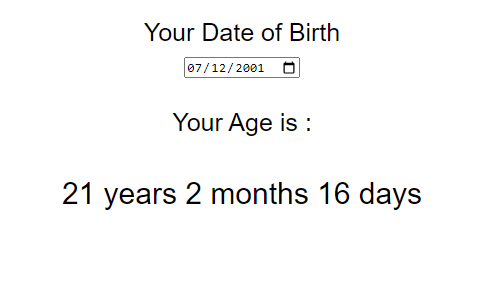

# Age Calculator-JS
## Techniques Used
- html
- css
- Java Script

### Time Taken: 2 hours

In this age calculator project I have used new Date() object to get current date and passed the input value to the new Object() to get the data of birth in month, year and days.Then I have used some conditions to get age.

[live link](https://age-calc-app-js.netlify.app/)

